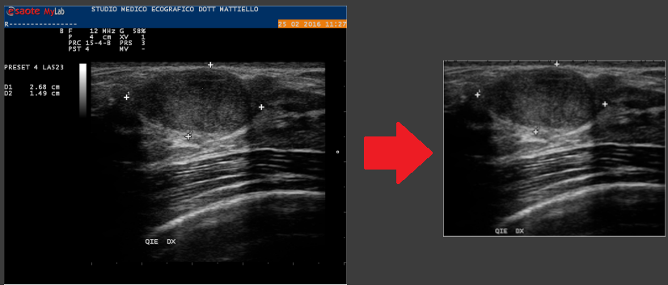

<!-- toc start: 3 [do not erase this comment] -->
**Table of contents**
- [DICOM ROI Extractor](#dicom-roi-extractor)
	- [Main Features](#main-features)
- [Usage](#usage)
- [Dependencies](#dependencies)
- [Author](#author)
<!-- toc end [do not erase this comment] -->

# DICOM ROI Extractor

This program allows you to extract a Region of Interest (ROI) from ultrasound raw images in DICOM format, resize them (if necessary), and save them back as DICOM files. It also supports visualization of DICOM images and extraction of metadata. This programm could be useful for data preprocessing in different scenarios such as training dataset for an AI model.



> ROI Extraction example

## Main Features

- **ROI Extraction**: Extracts the Region of Interest (ROI) from a DICOM ultrasound image.
- **Save as DICOM**: Saves the extracted image as a new DICOM file with the original metadata.
- **Visualize DICOM Images**: Visualizes DICOM images using Matplotlib.
- **Extract DICOM Metadata**: Extracts and prints the main metadata from a DICOM file.

# Usage

The program extracts the Region of Interest (ROI) from a DICOM/Raster ultrasound image, resizes it (if needed), and saves it as a new DICOM file (for DICOM input). Below some usage examples:

> Command prototype

```bash
python main.py -i <input_directory> -o <output_directory> -s <width,height>
```

> Work on DICOM images `[-d]` contained into the input directory `[-i]`, save the results in the specified output directory `[-o]`, resize the images with size `[-s]`

```bash
python main.py -d -i dicom_images -o output_dicom -s 256,256
```

If you want even the raster images (as `*.png`) you have to specify the overall `-r` or `--raster` as follow

```bash
python main.py -d -i <input_directory> -o <output_directory> -s <width,height> -r
```

The command above make the DICOM files and its relative `png` version; all raster images are contained in a dedicated directory called `raster`

> Example when the input are raster images

```bash
python main.py -i raster_images -o output_raster -s 256,256
```

# Dependencies

* `pydicom`
* `opencv4`
* `numpy`
* `matplotlib`

Install all dependencies using follow command:

```bash
pip install opencv-python numpy pydicom matplotlib
```

# Author

Emilio Garzia, 2024